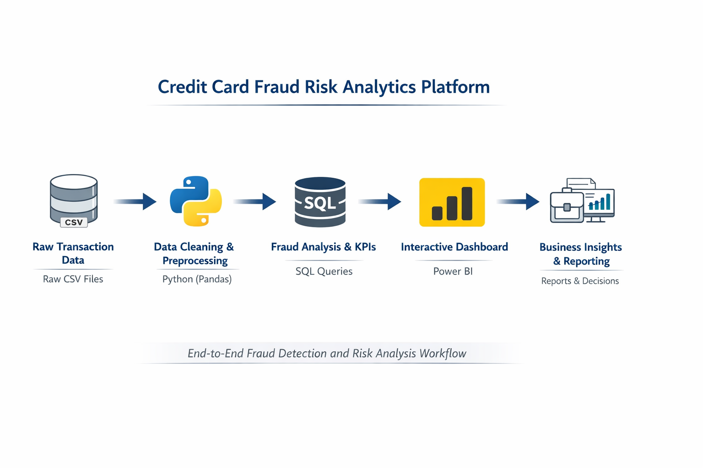

# 🚀 Credit Card Fraud Analytics Project

End-to-End Fraud Detection & Risk Analysis using **Python, SQL, and Power BI**

This project demonstrates a complete Data Analyst workflow where raw credit card transaction data is cleaned, analyzed, and visualized to identify fraudulent activity and generate business insights.

---
## 🏗️ Architecture / Workflow

## 📌 Project Objective

Credit card fraud leads to significant financial losses for banks and payment providers.  
The objective of this project is to:

- clean and prepare raw transaction data
- calculate fraud KPIs
- analyze fraud trends and risky behavior
- build an interactive dashboard for monitoring
- support data-driven fraud prevention

---

## 🛠️ Tools & Technologies

- Python (Pandas, Jupyter Notebook)
- SQL
- Power BI
- CSV datasets

---

## 🔁 Workflow

Raw Data → Python Cleaning → Clean CSV → SQL Analysis → Power BI Dashboard → Insights

This mirrors the real-world analytics pipeline used in industry.

---

## 📂 Repository Structure

- **data/**
  - raw → original transaction dataset
  - processed → cleaned & analysis-ready dataset

- **notebooks/**
  - Python data cleaning & EDA notebook

- **sql/**
  - fraud analysis queries

- **dashboard/**
  - Power BI dashboard (.pbix)

- **docs/**
  - reports and project documentation

- **README.md**

---

## 🔹 Step 1 – Data Cleaning using Python

Performed preprocessing and feature engineering using Pandas:

- handled datatypes and timestamps
- checked missing values
- created hour feature
- calculated fraud amount
- flagged high-value transactions
- exported cleaned dataset

Result: analysis-ready dataset

---

## 🔹 Step 2 – Data Analysis using SQL

Calculated business KPIs such as:

- total transactions
- fraud transactions
- fraud rate (%)
- total fraud loss
- fraud by month
- fraud by hour
- risky merchants
- country-wise fraud trends

Used GROUP BY, aggregations, and conditional logic.

---

## 🔹 Step 3 – Dashboard using Power BI

Built an interactive dashboard for visualization:

Features include:

- KPI cards (Fraud Rate, Loss, Transactions)
- monthly trends
- fraud by country
- fraud by transaction type
- top risky merchants
- hourly fraud patterns
- filters and drill-down analysis

Helps quickly identify high-risk areas.

---

## 📊 Key Insights

- Fraud rate is low (~3%) but causes high financial loss
- Fraud is higher during late-night hours
- High-value transactions show greater risk
- Few merchants contribute to most fraud cases
- Fraud activity is concentrated, not random

---

## 💼 Business Value

This analysis helps:

- detect fraud early
- reduce financial losses
- monitor risky behavior
- support faster investigation
- make data-driven decisions

---

## 🎯 Skills Demonstrated

- Data Cleaning (Pandas)
- Exploratory Data Analysis
- SQL Queries & KPIs
- Dashboard Development (Power BI)
- Business Insight Generation
- End-to-End Analytics Workflow

---

## 📌 Conclusion

This project shows how raw transaction data can be transformed into actionable insights using Python, SQL, and Power BI.

It reflects the practical responsibilities of a Data Analyst in real-world business scenarios.

--
⭐ Built as a hands-on analytics project to strengthen Data Analytics and Business Intelligence skills.
